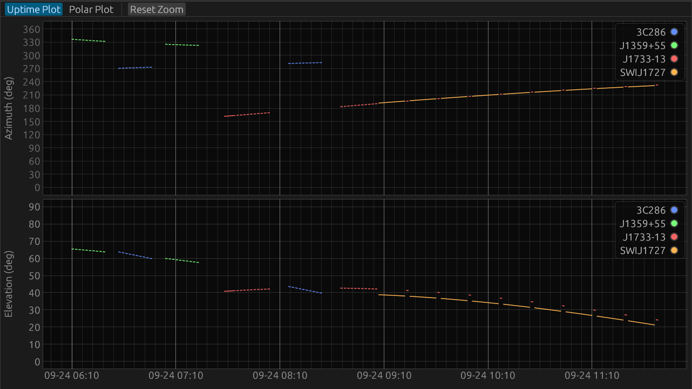
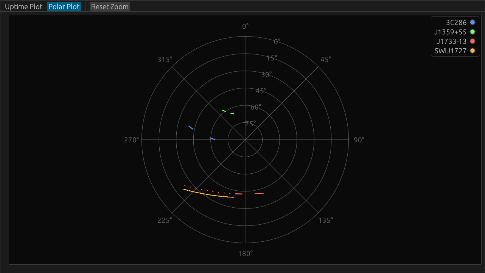

# drg2uptimeplot
This script creates an uptime plot graph of your DRG file, which is generated by PC-Sched or SKEDTool_JVN.    
SKEDTool_JVN: https://github.com/yuheiyta/SKEDTool_JVN  

## drg2uptimeplot.py  
Python version  

## drg2uptimeplor-rs
Rust version  
Install: cargo install --path . 

# Example
drg2uptimeplot-rs drg2uptimeplot-rs/I23267SW.DRG   
   
    
